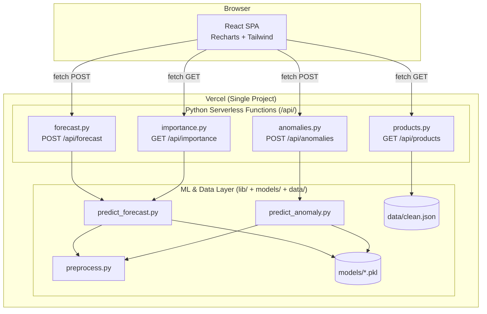

# Design Document: DemandSense — Demand Forecasting & Anomaly Detection System

## Overview

DemandSense is a production-deployed ML web application that forecasts retail demand and detects sales/pricing anomalies for the top 20 products in the UCI Online Retail Dataset. The system is deployed as a single Vercel project: a React SPA serves the dashboard, and four Python serverless functions handle ML inference. All models are pre-trained offline and committed to the repository as `.pkl` files, so every serverless invocation is purely inference — no training occurs at runtime.

The core user flow is:
1. A retail analyst opens the public Vercel URL.
2. The dashboard auto-selects the highest-volume product and fetches forecast, anomaly, and feature importance data.
3. The analyst can switch products, change the forecast horizon (7/14/30 days), and filter anomalies by type.
4. All charts and tables update in place; skeleton loaders and error messages ensure the screen is never blank.

**Key design constraints:**
- Vercel serverless timeout: 10 seconds (including cold-start model loading)
- Vercel per-function size limit: 50 MB
- Models are pre-trained and committed; inference must be fast enough to fit within the timeout
- No authentication, no real-time data ingestion, no Docker

---

## Architecture

The system is divided into three layers: a static React frontend, Python serverless API functions, and a shared ML/data layer loaded at cold start.



**Request lifecycle:**
1. Browser sends a `fetch()` request to `/api/<endpoint>`.
2. Vercel routes the request to the matching Python serverless function.
3. On cold start, the function imports `lib/` modules, which load `.pkl` models and `data/clean.json` into module-level globals (cached for warm invocations).
4. The function runs inference and returns a JSON response.
5. The React component receives the response, updates state, and re-renders.

**Routing (vercel.json):**
- `/api/*` → Python serverless functions
- All other paths → React `index.html` (SPA fallback)

---

## Components and Interfaces

### Backend Components

#### `lib/preprocess.py` — Feature Engineering Utilities

Shared utilities used by both training scripts and serverless functions. Responsible for:
- Cleaning raw UCI records (cancellation removal, negative quantity/price removal)
- Aggregating transactions to daily totals per StockCode
- Engineering all 10 model features
- Filling missing rolling/lag values with 0

Key functions:
```python
def clean_transactions(df: pd.DataFrame) -> pd.DataFrame:
    """Remove cancelled invoices, negative quantity/price rows."""

def aggregate_daily(df: pd.DataFrame) -> pd.DataFrame:
    """Group by StockCode + date, sum Quantity, compute mean UnitPrice."""

def engineer_features(df: pd.DataFrame) -> pd.DataFrame:
    """Add lag_1, lag_7, lag_14, rolling_7d_mean, rolling_30d_mean,
       rolling_7d_std, day_of_week, month, is_weekend, is_month_end.
       Fill NaN with 0."""

def build_future_features(last_known: pd.DataFrame, horizon: int) -> pd.DataFrame:
    """Construct a feature matrix for the next `horizon` days,
       using the last known history to compute lags and rolling stats."""
```

#### `lib/predict_forecast.py` — Forecast Inference

Loads XGBoost models at module level (cached across warm invocations). Exposes:
```python
# Module-level cache: populated on first import
_model_cache: dict[str, tuple[XGBRegressor, XGBRegressor, XGBRegressor]] = {}

def load_forecast_models(product_id: str) -> tuple[XGBRegressor, XGBRegressor, XGBRegressor]:
    """Load point, lower, upper models from models/ directory.
    Returns cached models if already loaded."""

def generate_forecast(product_id: str, horizon_days: int, history: pd.DataFrame
                      ) -> list[dict]:
    """Run iterative multi-step forecast. Returns list of
    {date, predicted, lower, upper} dicts."""

def get_feature_importances(product_id: str) -> list[dict]:
    """Return sorted list of {name, importance} from point model's
    feature_importances_ attribute."""

def compute_metrics(product_id: str, history: pd.DataFrame) -> dict:
    """Compute MAPE and RMSE on the last 20% of dates (holdout split).
    Returns {mape: float, rmse: float}."""
```

#### `lib/predict_anomaly.py` — Anomaly Detection Inference

```python
_iso_cache: dict[str, IsolationForest] = {}

def load_anomaly_model(product_id: str) -> IsolationForest:
    """Load Isolation Forest model from models/ directory. Cached."""

def score_anomalies(product_id: str, history: pd.DataFrame) -> list[dict]:
    """Run Isolation Forest + rule-based detectors on all historical records.
    Returns list of {date, quantity, unit_price, anomaly_score,
    is_anomaly, reason} dicts."""

def _detect_demand_spikes(df: pd.DataFrame) -> pd.Series:
    """Rolling Z-score: flag rows where quantity > 3σ above 30d rolling mean."""

def _detect_price_anomalies(df: pd.DataFrame) -> pd.Series:
    """Flag rows where unit_price deviates > 2.5σ from product median."""

def _detect_stockout_signals(df: pd.DataFrame) -> pd.Series:
    """Flag runs of 3+ consecutive zero-quantity days."""
```

#### API Handlers

Each handler is a standalone Python file in `api/`. They follow a consistent pattern:

```python
# api/forecast.py
def handler(request):
    # 1. Parse and validate request body
    # 2. Load history from data/clean.json (module-level cache)
    # 3. Call lib/predict_forecast.py
    # 4. Return JSON response or error
```

| File | Method | Path | Inputs | Outputs |
|------|--------|------|--------|---------|
| `forecast.py` | POST | `/api/forecast` | `{product_id, horizon_days}` | `{product_id, forecast[], metrics}` |
| `anomalies.py` | POST | `/api/anomalies` | `{product_id}` | `{product_id, anomalies[], total_anomalies}` |
| `products.py` | GET | `/api/products` | — | `[{product_id, description}]` |
| `importance.py` | GET | `/api/importance?product_id=` | `product_id` query param | `{product_id, features[]}` |

**Validation rules:**
- `product_id`: non-empty string; must exist in Model_Store → 404 if not found
- `horizon_days`: must be one of `{7, 14, 30}` → 400 if invalid
- Missing required fields → 400

### Frontend Components

```
frontend/src/
├── App.jsx                    # Root: state management, data fetching orchestration
├── api/
│   └── client.js              # fetch() wrappers for all 4 endpoints
└── components/
    ├── ProductSelector.jsx    # Searchable dropdown (filters by name + ID)
    ├── ForecastChart.jsx      # Recharts ComposedChart (line + area)
    ├── AnomalyTable.jsx       # Filterable table with filter chips + row highlighting
    ├── MetricsCards.jsx       # MAPE, RMSE, Total Anomalies cards
    └── FeatureImportance.jsx  # Recharts horizontal BarChart
```

#### `App.jsx` — State and Data Orchestration

Holds all application state and coordinates data fetching:

```javascript
// State shape
{
  products: [],           // from /api/products
  selectedProduct: null,  // currently selected product_id
  horizon: 14,            // 7 | 14 | 30
  forecast: null,         // from /api/forecast
  anomalies: null,        // from /api/anomalies
  importance: null,       // from /api/importance
  loading: {
    products: false,
    forecast: false,
    anomalies: false,
    importance: false,
  },
  errors: {
    products: null,
    forecast: null,
    anomalies: null,
    importance: null,
  }
}
```

On product or horizon change, `App.jsx` fires three parallel `fetch()` calls (forecast, anomalies, importance) and updates loading/error state per-region.

#### `api/client.js` — API Client

```javascript
export async function fetchForecast(productId, horizonDays) { ... }
export async function fetchAnomalies(productId) { ... }
export async function fetchProducts() { ... }
export async function fetchImportance(productId) { ... }
```

Each function throws a typed error on non-2xx responses so `App.jsx` can set per-region error state.

#### `ForecastChart.jsx`

- Recharts `ComposedChart` with:
  - `Line` for historical actuals (solid)
  - `Line` for forecast predicted values (dashed)
  - `Area` for confidence band (lower/upper)
- Custom `Tooltip` that shows date + actual for historical points, and date + predicted + lower + upper for forecast points
- Renders `SkeletonLoader` while `loading.forecast` is true
- Renders error message if `errors.forecast` is set

#### `AnomalyTable.jsx`

- Filter chips: All / Demand Spike / Price Anomaly / Stockout Signal
- Row highlighting: red if `anomaly_score < -0.1`, amber if `-0.1 ≤ anomaly_score ≤ 0.0`
- Empty state message when `anomalies.length === 0`

#### `MetricsCards.jsx`

- Three cards: MAPE, RMSE, Total Anomalies
- Shows "N/A" if value is unavailable
- Skeleton loaders while fetching; error indicator on failure

#### `FeatureImportance.jsx`

- Recharts `BarChart` (horizontal layout)
- Bars sorted descending by importance
- Each bar labeled with feature name + importance to 3 decimal places
- Subtitle: "What drove this forecast"

---

## Data Models

### `data/clean.json` — Preprocessed Dataset

A flat JSON array. Each record represents one product's sales on one calendar date:

```typescript
interface CleanRecord {
  stock_code: string;        // UCI StockCode (e.g., "85123A")
  description: string;       // Product name
  date: string;              // ISO 8601 date (e.g., "2011-01-04")
  quantity: number;          // Daily total units sold
  unit_price: number;        // Mean unit price for that day
  day_of_week: number;       // 0=Monday … 6=Sunday
  month: number;             // 1–12
  is_weekend: 0 | 1;
  is_month_end: 0 | 1;
  rolling_7d_mean: number;   // 0 if insufficient history
  rolling_30d_mean: number;  // 0 if insufficient history
  rolling_7d_std: number;    // 0 if insufficient history
  lag_1: number;             // 0 if insufficient history
  lag_7: number;             // 0 if insufficient history
  lag_14: number;            // 0 if insufficient history
}
```

### Model Files (`models/`)

| Pattern | Type | Description |
|---------|------|-------------|
| `xgb_{product_id}.pkl` | `XGBRegressor` | Point forecast model |
| `xgb_lower_{product_id}.pkl` | `XGBRegressor` | Lower bound (q=0.1) quantile model |
| `xgb_upper_{product_id}.pkl` | `XGBRegressor` | Upper bound (q=0.9) quantile model |
| `iso_{product_id}.pkl` | `IsolationForest` | Anomaly detection model |

All serialized with `joblib.dump`. Total model store ≤ 50 MB.

### API Request/Response Schemas

#### POST `/api/forecast`

```typescript
// Request
interface ForecastRequest {
  product_id: string;
  horizon_days: 7 | 14 | 30;
}

// Response (200)
interface ForecastResponse {
  product_id: string;
  forecast: Array<{
    date: string;       // ISO 8601
    predicted: number;
    lower: number;      // lower ≤ predicted ≤ upper guaranteed
    upper: number;
  }>;
  metrics: {
    mape: number;       // ≥ 0, percentage
    rmse: number;       // ≥ 0
  };
}
```

#### POST `/api/anomalies`

```typescript
// Request
interface AnomaliesRequest {
  product_id: string;
}

// Response (200)
interface AnomaliesResponse {
  product_id: string;
  anomalies: Array<{
    date: string;
    quantity: number;
    unit_price: number;
    anomaly_score: number;
    is_anomaly: boolean;
    reason: "demand_spike" | "price_anomaly" | "stockout_signal" | "isolation_forest";
  }>;
  total_anomalies: number;  // === anomalies.length
}
```

#### GET `/api/importance?product_id=`

```typescript
// Response (200)
interface ImportanceResponse {
  product_id: string;
  features: Array<{
    name: string;
    importance: number;  // may be negative; sorted descending
  }>;
}
```

#### GET `/api/products`

```typescript
// Response (200)
type ProductsResponse = Array<{
  product_id: string;
  description: string;
}>;
// Sorted descending by total sales volume
```

#### Error Responses

```typescript
interface ErrorResponse {
  error: string;  // Human-readable message
}
// HTTP 400: invalid input
// HTTP 404: product not found
// HTTP 500: model/data load failure
```

### Frontend State Shape

```typescript
interface AppState {
  products: Array<{ product_id: string; description: string }>;
  selectedProduct: string | null;
  horizon: 7 | 14 | 30;
  forecast: ForecastResponse | null;
  anomalies: AnomaliesResponse | null;
  importance: ImportanceResponse | null;
  loading: Record<"products" | "forecast" | "anomalies" | "importance", boolean>;
  errors: Record<"products" | "forecast" | "anomalies" | "importance", string | null>;
}
```

### Multi-Step Forecast Generation

The forecast is generated iteratively because XGBoost requires lag features that depend on prior predictions:

```
For step t in [1 .. horizon_days]:
  1. Build feature row using:
     - lag_1  = prediction at t-1 (or last known actual if t=1)
     - lag_7  = prediction at t-7 (or historical actual if t ≤ 7)
     - lag_14 = prediction at t-14 (or historical actual if t ≤ 14)
     - rolling stats = computed over the combined history + predictions so far
     - calendar features = derived from the target date
  2. Run point model → predicted
  3. Run lower model → lower
  4. Run upper model → upper
  5. Clamp: lower = min(lower, predicted), upper = max(upper, predicted)
  6. Append {date, predicted, lower, upper} to output
  7. Append predicted to rolling history for next step
```

---

## Correctness Properties

*A property is a characteristic or behavior that should hold true across all valid executions of a system — essentially, a formal statement about what the system should do. Properties serve as the bridge between human-readable specifications and machine-verifiable correctness guarantees.*


### Property 1: Data Cleaning Removes All Invalid Records

*For any* transaction dataset, after applying `clean_transactions()`, the output SHALL contain no records where InvoiceNo begins with `'C'`, Quantity is ≤ 0, or UnitPrice is ≤ 0.

**Validates: Requirements 1.1, 1.2, 1.3**

---

### Property 2: Daily Aggregation Preserves Quantity Sum

*For any* set of cleaned transaction records sharing the same (StockCode, date) pair, after `aggregate_daily()`, the output quantity for that (StockCode, date) group SHALL equal the sum of all input Quantity values for that group.

**Validates: Requirements 1.4**

---

### Property 3: Feature Engineering Produces a Complete, Non-Null Feature Set

*For any* aggregated daily dataset, after `engineer_features()`, every output record SHALL contain all 10 engineered feature columns (`day_of_week`, `month`, `is_weekend`, `rolling_7d_mean`, `rolling_30d_mean`, `rolling_7d_std`, `lag_1`, `lag_7`, `lag_14`, `is_month_end`) and none of those columns SHALL contain a NaN or null value.

**Validates: Requirements 1.5**

---

### Property 4: Top-20 Selection Invariant

*For any* aggregated dataset with more than 20 distinct StockCodes, after subsetting to the top 20 by total sales volume, the output SHALL contain at most 20 distinct StockCodes, and no excluded StockCode SHALL have a higher total sales volume than any included StockCode.

**Validates: Requirements 1.6**

---

### Property 5: Preprocessed Data Serialization Round-Trip

*For any* preprocessed DataFrame, serializing it to JSON and deserializing it back SHALL produce a dataset where every record and every field value is equivalent to the original (within floating-point precision).

**Validates: Requirements 1.7**

---

### Property 6: Short-History Products Are Excluded

*For any* dataset, after preprocessing, no StockCode in the output SHALL have fewer than 30 days of historical records.

**Validates: Requirements 1.8**

---

### Property 7: Demand Spike Detection Rule

*For any* daily record where at least 30 days of prior history exist for the product, if the record's quantity exceeds 3 standard deviations above the 30-day rolling mean, then `_detect_demand_spikes()` SHALL flag that record as a demand spike. Conversely, if fewer than 30 days of prior history exist, the demand spike flag SHALL remain unset for that record.

**Validates: Requirements 3.2**

---

### Property 8: Price Anomaly Detection Rule

*For any* daily record, if the unit price deviates more than 2.5 standard deviations from the product's median unit price (and the product's unit price standard deviation is non-zero), then `_detect_price_anomalies()` SHALL flag that record as a price anomaly.

**Validates: Requirements 3.3**

---

### Property 9: Stockout Signal Detection Rule

*For any* product time series, every day that is part of a run of 3 or more consecutive days with zero sales SHALL be flagged as a stockout signal by `_detect_stockout_signals()`.

**Validates: Requirements 3.4**

---

### Property 10: Anomaly Output Structure and Priority Ordering

*For any* product history processed by `score_anomalies()`, every output record SHALL contain `anomaly_score` (numeric), `is_anomaly` (boolean), and `reason` (string) fields. When multiple detectors fire for the same record, the `reason` SHALL follow the priority order `demand_spike` > `price_anomaly` > `stockout_signal` > `isolation_forest`.

**Validates: Requirements 3.7**

---

### Property 11: Forecast Array Length Equals Horizon

*For any* valid `product_id` and `horizon_days` value in `{7, 14, 30}`, the `forecast` array returned by `POST /api/forecast` SHALL contain exactly `horizon_days` entries.

**Validates: Requirements 4.1**

---

### Property 12: Confidence Band Ordering Invariant

*For any* valid forecast response, every entry in the `forecast` array SHALL satisfy `lower ≤ predicted ≤ upper`.

**Validates: Requirements 4.2**

---

### Property 13: Forecast Metrics Are Non-Negative

*For any* valid `product_id`, the `metrics` object in the `POST /api/forecast` response SHALL contain `mape ≥ 0` and `rmse ≥ 0`.

**Validates: Requirements 2.5, 4.3**

---

### Property 14: Invalid Horizon Returns HTTP 400

*For any* `horizon_days` value not in `{7, 14, 30}`, a `POST /api/forecast` request SHALL return an HTTP 400 response.

**Validates: Requirements 4.5**

---

### Property 15: Anomaly Count Invariant

*For any* valid `product_id`, the `total_anomalies` field in the `POST /api/anomalies` response SHALL equal the length of the `anomalies` array.

**Validates: Requirements 5.1**

---

### Property 16: Anomaly Record Structure

*For any* valid `product_id`, every entry in the `anomalies` array SHALL contain `date` (string), `quantity` (numeric), `unit_price` (numeric), `anomaly_score` (numeric), `is_anomaly` (boolean), and `reason` (one of the four valid reason strings) fields.

**Validates: Requirements 5.2**

---

### Property 17: Missing or Malformed Product ID Returns HTTP 400

*For any* POST request to `/api/anomalies` with a missing or empty `product_id` field, the API SHALL return an HTTP 400 response.

**Validates: Requirements 5.5**

---

### Property 18: Feature Importance Response Structure and Ordering

*For any* valid `product_id`, the `GET /api/importance` response SHALL contain a `features` array where every entry has `name` (string) and `importance` (numeric) fields, and the array SHALL be sorted in descending order of `importance` value.

**Validates: Requirements 6.1, 6.2**

---

### Property 19: Products Response Completeness and Structure

*For any* Model_Store state, the `GET /api/products` response SHALL return exactly the set of products available in the Model_Store, and every entry SHALL contain `product_id` (string) and `description` (string) fields.

**Validates: Requirements 7.1, 7.2**

---

### Property 20: Products Sorted by Descending Sales Volume

*For any* `data/clean.json` dataset, the `GET /api/products` response SHALL return products in descending order of total sales volume (sum of Quantity across all records for that product).

**Validates: Requirements 7.3**

---

## Error Handling

### Backend Error Handling

**Input Validation (400 Bad Request)**
- `POST /api/forecast`: missing `product_id`, missing `horizon_days`, or `horizon_days` not in `{7, 14, 30}`
- `POST /api/anomalies`: missing or empty `product_id`
- `GET /api/importance`: missing `product_id` query parameter
- All 400 responses include `{"error": "<descriptive message>"}` body

**Not Found (404)**
- Any endpoint receiving a `product_id` not present in the Model_Store returns 404
- Error body: `{"error": "Product '{product_id}' not found"}`

**Internal Errors (500)**
- Model file missing or corrupt: `{"error": "Failed to load model for product '{product_id}'"}`
- `data/clean.json` missing or unreadable: `{"error": "Failed to load product data"}`
- Unexpected exceptions are caught at the handler level, logged, and returned as 500

**Model Loading Strategy**
Models are loaded at module level using a `_model_cache` dict. On first access for a given `product_id`, the model is loaded from disk and stored in the cache. Subsequent warm invocations reuse the cached object, avoiding repeated disk I/O. If loading fails, the exception propagates to the handler which returns a 500 response.

```python
def load_forecast_models(product_id: str):
    if product_id not in _model_cache:
        try:
            point = joblib.load(f"models/xgb_{product_id}.pkl")
            lower = joblib.load(f"models/xgb_lower_{product_id}.pkl")
            upper = joblib.load(f"models/xgb_upper_{product_id}.pkl")
            _model_cache[product_id] = (point, lower, upper)
        except FileNotFoundError:
            raise ModelNotFoundError(product_id)
        except Exception as e:
            raise ModelLoadError(product_id, str(e))
    return _model_cache[product_id]
```

**Preprocessing Script Error Handling**
- Missing input file: print error with file path, `sys.exit(1)`
- StockCode with < 30 days history: exclude silently (logged at DEBUG level)
- StockCode with < 60 days for training: log WARNING, skip training, continue

### Frontend Error Handling

**Per-Region Error State**
Each data region (ForecastChart, AnomalyTable, MetricsCards, FeatureImportance) has independent error state. A failure in one region does not affect others.

**Error Display Pattern**
```
[Error message identifying the failed operation]
[Retry button]
[Previously loaded data for prior product, if available]
```

**Timeout Handling**
The `api/client.js` fetch wrappers use `AbortController` with a 12-second timeout (slightly above the 10-second serverless limit) to prevent indefinite hangs on cold-start terminations.

**Initial Load Failure**
If `/api/products` fails on initial load, the product selector region shows an error with a "Refresh page" instruction. The rest of the dashboard shows the "Select a product" prompt.

**Never Blank**
The `App.jsx` render logic ensures at least one of the following is always visible: a skeleton loader, an error message, a data component, or the initial "Select a product" prompt.

---

## Testing Strategy

### Overview

The testing strategy uses a dual approach: property-based tests for universal correctness properties and example-based unit/integration tests for specific behaviors, error conditions, and UI interactions.

### Property-Based Testing

**Library:** [Hypothesis](https://hypothesis.readthedocs.io/) (Python) for backend properties.

**Configuration:** Each property test runs a minimum of 100 iterations (`@settings(max_examples=100)`).

**Tag format:** Each test is tagged with a comment:
```python
# Feature: demand-sense, Property N: <property_text>
```

**Properties to implement as Hypothesis tests:**

| Property | Test File | Strategy |
|----------|-----------|----------|
| 1: Data cleaning removes invalid records | `tests/test_preprocess.py` | `st.dataframes()` with mixed valid/invalid rows |
| 2: Aggregation preserves quantity sum | `tests/test_preprocess.py` | `st.dataframes()` with known (StockCode, date) groups |
| 3: Feature engineering completeness | `tests/test_preprocess.py` | `st.dataframes()` with varying history lengths |
| 4: Top-20 selection invariant | `tests/test_preprocess.py` | `st.lists()` of (StockCode, volume) pairs |
| 5: Serialization round-trip | `tests/test_preprocess.py` | `st.dataframes()` of preprocessed records |
| 6: Short-history exclusion | `tests/test_preprocess.py` | `st.dataframes()` with some products < 30 days |
| 7: Demand spike detection | `tests/test_anomaly.py` | `st.floats()` for quantity, mean, std |
| 8: Price anomaly detection | `tests/test_anomaly.py` | `st.floats()` for price, median, std |
| 9: Stockout signal detection | `tests/test_anomaly.py` | `st.lists(st.integers(min_value=0))` for quantity sequences |
| 10: Anomaly output structure + priority | `tests/test_anomaly.py` | `st.dataframes()` with known detector triggers |
| 11: Forecast array length | `tests/test_forecast_api.py` | `st.sampled_from(valid_products)`, `st.sampled_from([7,14,30])` |
| 12: Confidence band ordering | `tests/test_forecast_api.py` | `st.sampled_from(valid_products)`, `st.sampled_from([7,14,30])` |
| 13: Metrics non-negative | `tests/test_forecast_api.py` | `st.sampled_from(valid_products)` |
| 14: Invalid horizon → 400 | `tests/test_forecast_api.py` | `st.integers().filter(lambda x: x not in {7,14,30})` |
| 15: Anomaly count invariant | `tests/test_anomaly_api.py` | `st.sampled_from(valid_products)` |
| 16: Anomaly record structure | `tests/test_anomaly_api.py` | `st.sampled_from(valid_products)` |
| 17: Missing product_id → 400 | `tests/test_anomaly_api.py` | `st.one_of(st.none(), st.just(""), st.just("   "))` |
| 18: Importance structure + ordering | `tests/test_importance_api.py` | `st.sampled_from(valid_products)` |
| 19: Products completeness + structure | `tests/test_products_api.py` | Fixed (Model_Store is deterministic) |
| 20: Products sorted by volume | `tests/test_products_api.py` | Fixed (clean.json is deterministic) |

### Unit Tests (Example-Based)

**Backend unit tests** (`tests/`):
- Preprocessor: missing input file exits with non-zero status (Req 1.9)
- Forecaster: product with < 60 days is skipped with warning (Req 2.8)
- API: unknown product_id returns 404 (Reqs 4.4, 5.3, 6.4)
- API: missing model file returns 500 (Req 4.8)
- API: missing `data/clean.json` returns 500 (Req 7.4)
- API: missing `product_id` query param on `/api/importance` returns 400 (Req 6.5)
- Feature importances match model's `feature_importances_` attribute (Req 6.3)

**Frontend unit tests** (Jest + React Testing Library):
- `ProductSelector`: renders dropdown with products, filters by name and ID
- `ForecastChart`: renders skeleton loader while loading, renders error on failure
- `AnomalyTable`: filter chips correctly filter rows by reason
- `AnomalyTable`: rows highlighted red/amber based on anomaly_score thresholds
- `AnomalyTable`: empty state message when anomalies array is empty
- `MetricsCards`: shows "N/A" when metric value is unavailable
- `FeatureImportance`: shows error message when features array is empty
- `App`: auto-selects first product on initial load
- `App`: retains prior product data when a new request fails

### Integration Tests

- Model quality: MAPE < 15% per product on holdout split (Req 2.4)
- Anomaly detection: F1 > 0.75 on synthetic anomaly injection (Req 3.5)
- Warm API response time < 2 seconds (Req 4.6)
- Cold-start response time < 10 seconds (Req 4.7, 5.4, 13.6)

### Smoke Tests (Post-Deployment)

- All 4 API endpoints return 200 for a known valid product
- Model files exist with correct naming pattern for all 20 products
- Total model store size ≤ 50 MB
- `data/clean.json` is present and parseable
- Vercel deployment is publicly accessible without authentication
