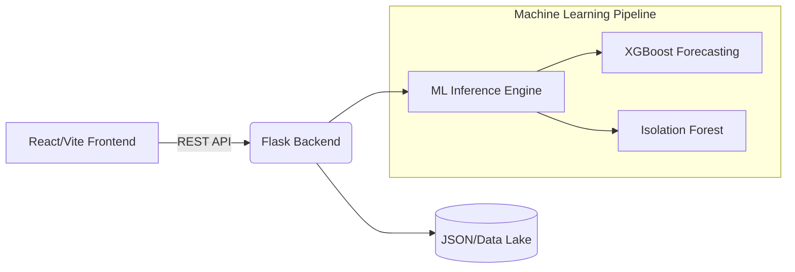

<div align="center">
  <h1>DemandSense</h1>
  <p><strong>Enterprise-Grade Retail Demand Forecasting & Anomaly Detection System</strong></p>

  
  
  
  
  
</div>

<div align="center">
  <h3>Live Demo: <a href="https://demand-sense-w4ba.vercel.app">demand-sense-w4ba.vercel.app</a></h3>
  <p>Backend API: <a href="https://demandsense-5ej8.onrender.com">demandsense-5ej8.onrender.com</a></p>
</div>

<br />

DemandSense is an AI-powered retail intelligence platform that predicts future sales volume and automatically detects critical business events, such as out-of-stock risks and unseasonal demand spikes. Built to solve real-world retail inventory challenges, it combines a highly responsive React frontend with a scalable Python/Flask machine learning backend.

## Key Capabilities

* **Predictive Forecasting (XGBoost):** Leverages historical sales data, seasonal trends, and lagging indicators to predict future demand across 7, 14, and 30-day horizons with dynamic confidence intervals.
* **Automated Anomaly Detection (Isolation Forest):** Unsupervised learning algorithms actively monitor data to flag anomalous sales patterns, categorizing them into high-priority "Act Now" events (stockouts) and "Keep an Eye On" events (demand spikes).
* **Retail-Optimized Dashboard:** A dark-mode, high-performance UI featuring interactive visualizations via Recharts, tailored for quick decision-making rather than data overload.
* **Automated CI/CD:** Fully integrated GitHub Actions pipeline ensuring backend unit tests (Pytest) and frontend component tests (Jest) pass before deployment.

---

## System Architecture



### Technology Stack

**Frontend (Client)**
* **Core:** React 18, Vite, Node.js
* **Styling:** TailwindCSS
* **Visualizations:** Recharts
* **Testing:** Jest, React Testing Library

**Backend & Data Science (Server)**
* **Core:** Python 3.11, Flask, Gunicorn
* **Data Processing:** Pandas, NumPy
* **Machine Learning:** Scikit-Learn (Isolation Forest), XGBoost
* **Testing:** Pytest, Hypothesis (Property-based testing)

---

## Getting Started Locally

DemandSense is designed to be easily reproducible on local machines.

### 1. Backend Setup

```bash
# Clone the repository
git clone https://github.com/Shy4n7/DemandSense.git
cd DemandSense

# Install Python dependencies
pip install -r requirements.txt

# Start the Flask API server
python server.py
```

The API will be available at `http://localhost:8000`.

### 2. Frontend Setup

Open a new terminal window:

```bash
cd frontend

# Install Node dependencies
npm install

# Start the Vite development server
npm run dev
```

The interactive dashboard will be available at `http://localhost:5173`.

---

## Deployment

DemandSense is deployed as two services:

* **Frontend:** Vercel serves the React/Vite dashboard from `frontend/`.
* **Backend:** Render serves the Flask/Gunicorn API from `server.py`.

### Frontend Environment

Set this environment variable in Vercel so the dashboard calls the Render API:

```bash
VITE_API_BASE_URL=https://demandsense-5ej8.onrender.com
```

The frontend also has a production fallback to the same Render URL, but setting the variable explicitly is recommended for future backend URL changes.

### Backend Health Check

Use the lightweight health endpoint for uptime monitors and auto pingers:

```text
https://demandsense-5ej8.onrender.com/api/health
```

The backend also exposes `/health`. Prefer HTTPS URLs in pingers; using `http://` may produce a `301 Moved Permanently` redirect that some monitors report as a failure.

### CORS Notes

The backend handles CORS preflight requests before API validation. This is required for browser POST requests such as:

* `POST /api/forecast`
* `POST /api/anomalies`

If the deployed dashboard shows `Failed to fetch` for forecast or anomaly data, first confirm Render has redeployed the latest `main` branch and that `OPTIONS /api/forecast` returns `204`.

---

## Machine Learning Retraining

The pre-trained models are included in the repository. However, if you wish to retrain the models from scratch using the underlying data engine:

```bash
# Execute the automated feature engineering and model training pipeline
python scripts/train_forecast.py

# Execute the unsupervised anomaly detection training pipeline
python scripts/train_anomaly.py
```

Artifacts are automatically serialized and saved to the `/models` directory.
