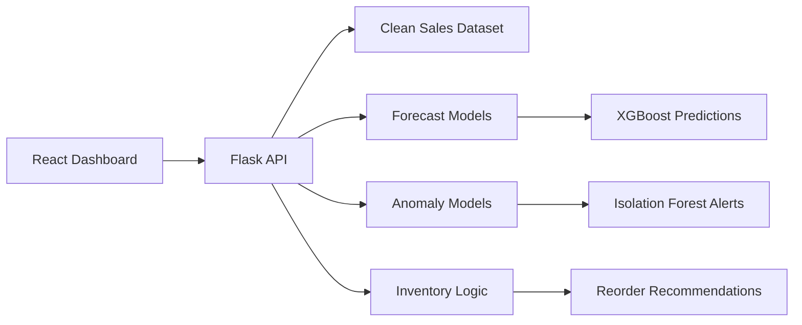

<div align="center">
  <h1>DemandSense</h1>
  <p><strong>AI-powered retail demand forecasting, anomaly detection, and inventory decision support</strong></p>

  
  
  
  
  
  
</div>

<div align="center">
  <h3><a href="https://demand-sense-w4ba.vercel.app">Live Demo</a></h3>
</div>

---

## Overview

DemandSense is a full-stack machine learning application that helps retail teams anticipate product demand, detect unusual sales behavior, and make faster inventory decisions. It combines a React dashboard with a Python/Flask inference backend and pre-trained machine learning models for forecasting and anomaly detection.

The project is designed as a practical retail intelligence system: instead of only showing charts, it turns sales history into operational signals such as expected demand, stock risk, reorder guidance, anomaly alerts, and model explainability.

## Why This Project Matters

Retail inventory planning is a high-impact forecasting problem. Ordering too little creates stockouts and lost revenue; ordering too much creates excess inventory and cash-flow pressure. DemandSense addresses this by combining time-series forecasting, anomaly detection, and inventory planning into one interactive dashboard.

This project demonstrates the ability to build beyond a model notebook: data preparation, trained model artifacts, API design, frontend state management, testing, deployment readiness, and a polished user experience all work together as one product.

## Highlights

* **Demand Forecasting:** Predicts future product demand using XGBoost models trained on historical sales patterns.
* **Anomaly Detection:** Flags unusual demand spikes and stockout-like behavior with Isolation Forest models.
* **Inventory Decision Support:** Calculates safety stock, reorder points, current stock status, and suggested order quantities.
* **Model Explainability:** Surfaces feature-importance insights so forecasts are easier to interpret.
* **Interactive Dashboard:** Provides product selection, KPI cards, forecast visualizations, anomaly tables, and inventory planning controls.
* **Production-Oriented Structure:** Separates frontend, backend, data processing, model inference, tests, and deployment assets.

## Demo Experience

The dashboard is built for quick retail decision-making:

* Select a product and view expected demand.
* Compare forecasted demand against recent historical sales.
* Identify products with demand anomalies or stockout signals.
* Adjust inventory inputs such as current stock and lead time.
* Review reorder recommendations and stock-risk status.

## Tech Stack

**Frontend**
* React 18
* Vite
* TailwindCSS
* Recharts
* Jest and React Testing Library

**Backend and ML**
* Python 3.11
* Flask
* Gunicorn
* Pandas and NumPy
* XGBoost
* Scikit-learn
* Pytest and Hypothesis

**Deployment and Engineering**
* Docker-ready backend
* Vercel-ready frontend
* Render-compatible Flask service
* Modular API handlers
* Cached model/data loading for faster inference

## Architecture



## Machine Learning Workflow

DemandSense includes an end-to-end workflow for turning raw retail transactions into decision-ready predictions:

1. Clean and aggregate sales history into product-level daily demand records.
2. Engineer time-series features such as lag values, rolling statistics, and seasonal indicators.
3. Train XGBoost models for demand forecasting.
4. Train Isolation Forest models for anomaly detection.
5. Serialize trained model artifacts for API inference.
6. Serve predictions through Flask endpoints consumed by the React dashboard.

## Project Structure

```text
DemandSense/
|-- api/                 # Flask API handlers
|-- data/                # Processed demand dataset
|-- frontend/            # React/Vite dashboard
|-- lib/                 # Forecasting, anomaly, inventory, and preprocessing logic
|-- models/              # Serialized ML model artifacts
|-- scripts/             # Training and preprocessing scripts
|-- tests/               # Backend, property-based, and smoke tests
|-- server.py            # Combined Flask app for deployment
`-- Dockerfile           # Containerized backend/runtime setup
```

## Getting Started

### Backend

```bash
git clone https://github.com/Shy4n7/DemandSense.git
cd DemandSense
pip install -r requirements.txt
python server.py
```

### Frontend

```bash
cd frontend
npm install
npm run dev
```

## Testing

```bash
# Backend tests
pytest

# Frontend tests
cd frontend
npm test
```

## Model Retraining

```bash
python scripts/train_forecast.py
python scripts/train_anomaly.py
```

## Skills Demonstrated

* Full-stack product engineering with React and Flask
* Machine learning model training and inference integration
* Time-series feature engineering for retail demand data
* Anomaly detection for operational risk signals
* API design for ML-powered applications
* Frontend data visualization and dashboard UX
* Automated testing across backend and frontend layers
* Deployment-ready project organization

## Resume Summary

Built an end-to-end retail intelligence platform that forecasts product demand, detects sales anomalies, and recommends inventory actions using React, Flask, XGBoost, Scikit-learn, and Docker-ready deployment architecture.
